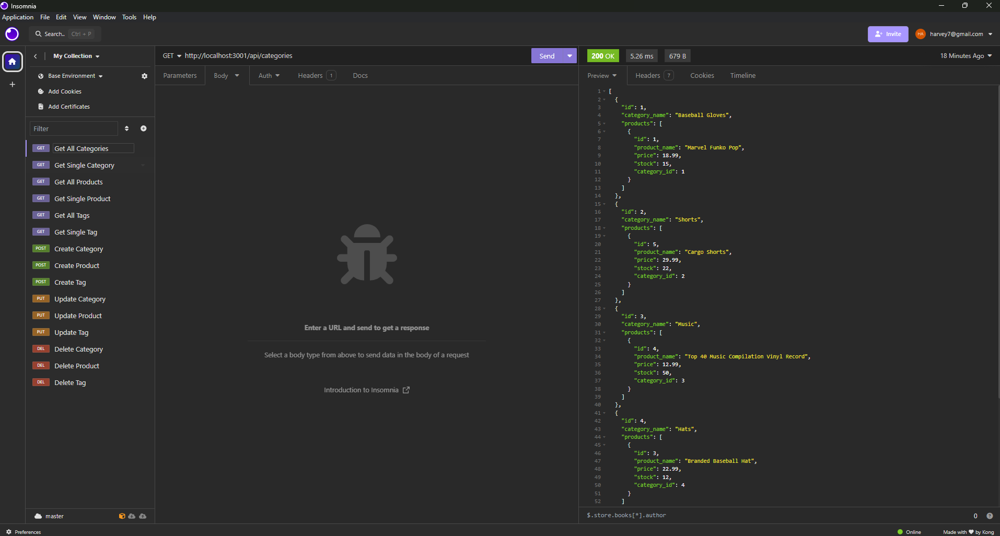
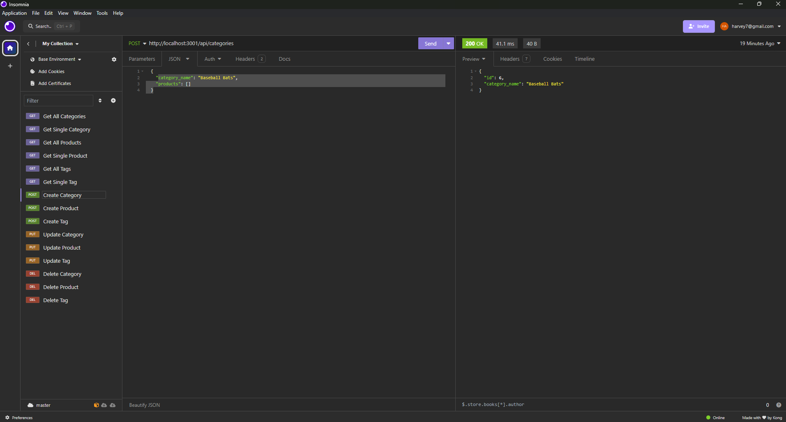
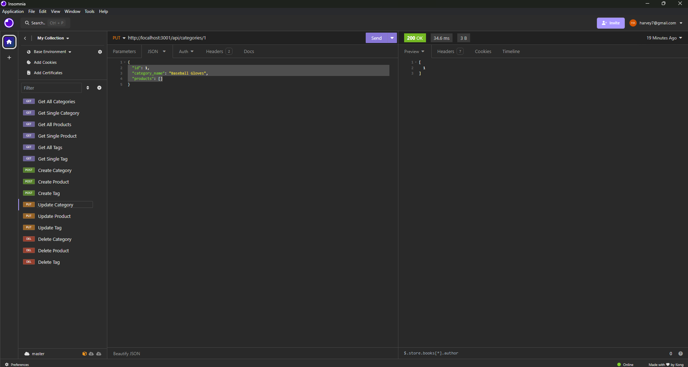
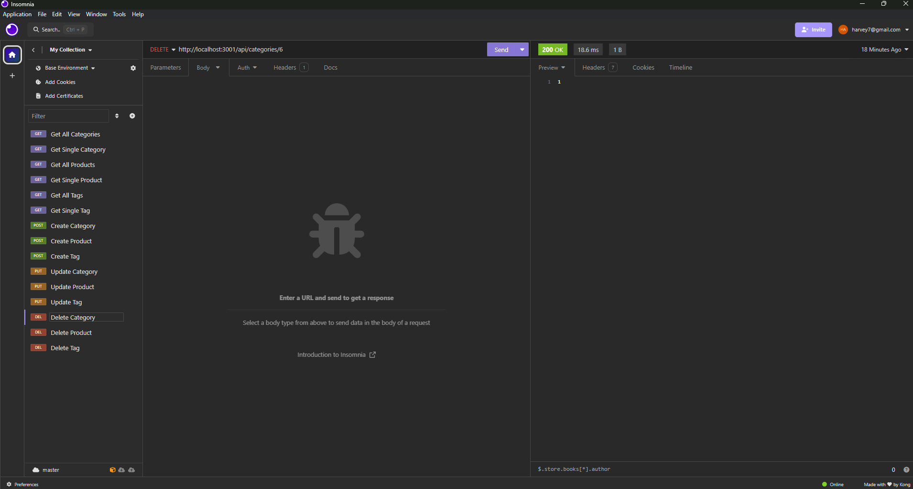

# E-Commerce-Back-End

## Table of Contents

* [Description](#description)
* [Installation](#installation)
* [Usage](#usage)
* [Credits](#credits)
* [Screenshots](#screenshots)
* [Video](#video)
* [Link to Website](#link-to-website)
* [License](#license)

## Description

This application is the back end of an E-Commerce site that utilizes the latest technologies. This application will allow your business to remain competitive with other E-Commerce companies.

## Installation

MySQL, Node.js, Express.js and Insomnia must be installed in order to fully utilize this application. In order to utilize this application, the user must install the following dependencies: Dotenv, Express, MySQL2, and Sequelize. Once all code is downloaded, the user can install these dependencies by entering the command "npm install" in their CLI. The user will also need to source the schema.sql file by entering the "db" folder, logging into mySQL, and then entering "source schema.sql". Lastly, in CLI the user will enter the command "npm run seed" to seed database.

## Usage

After following installation procedures, the user can enter the command "npm start" in their CLI. Once server is running, the user can open Insomnia application and perform POST, PUT, and DELETE operations. The User can also run GET commands to view database information.

## Credits

Starter Code obtained from: https://github.com/coding-boot-camp/fantastic-umbrella

Project Done in collaboration with coding students Kalyn Sifuentes, Joshua Hale, and Angela Cortes.

Tutor Assistance provided by Wesley Clements.

YouTube Video Accessed for function guidance: https://www.youtube.com/watch?v=hGVJLTGqPgk&t=379s by Thomas Calle

## Screenshots

Insomnia Get Request: 

Insomnia Post Request:

Insomnia Put Request:

Insomnia Delete Request:

## Video

Link to Main Functionality: https://drive.google.com/file/d/1_2y2_JVH49WyiZuIiNoWnvt4ICoqAW67/view

## Link to Website

N/A

## License

This application is licensed under the Apache 2.0 License.

https://opensource.org/licenses/Apache-2.0